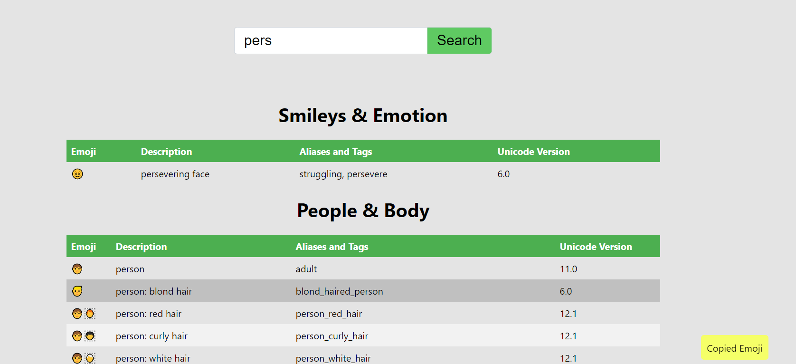

# Emojis

A website dedicated to finding the emoji you want

https://zeyu-li.github.io/emojis-finder/build/index.html

## Use

Just enter text in the search bar and the emojis with anything in the description or aliases or tags that contains the search will be found!

Clicking on a row in the table will copy the emoji to the clipboard

# Acknowledgements

Built with React

* emoji json file from https://github.com/github/gemoji/blob/master/db/emoji.json
* [create-react-app](https://github.com/facebook/create-react-app)
* icon is an Microsoft emoji (https://emojipedia.org/open-book/)
